

OSS PaaS and DevOps

Before the hands-on lab setup guide

November 2019

Information in this document, including URL and other Internet Web site references, is subject to change without notice. Unless otherwise noted, the example companies, organizations, products, domain names, e-mail addresses, logos, people, places, and events depicted herein are fictitious, and no association with any real company, organization, product, domain name, e-mail address, logo, person, place or event is intended or should be inferred. Complying with all applicable copyright laws is the responsibility of the user. Without limiting the rights under copyright, no part of this document may be reproduced, stored in or introduced into a retrieval system, or transmitted in any form or by any means (electronic, mechanical, photocopying, recording, or otherwise), or for any purpose, without the express written permission of Microsoft Corporation.

Microsoft may have patents, patent applications, trademarks, copyrights, or other intellectual property rights covering subject matter in this document. Except as expressly provided in any written license agreement from Microsoft, the furnishing of this document does not give you any license to these patents, trademarks, copyrights, or other intellectual property.

The names of manufacturers, products, or URLs are provided for informational purposes only and Microsoft makes no representations and warranties, either expressed, implied, or statutory, regarding these manufacturers or the use of the products with any Microsoft technologies. The inclusion of a manufacturer or product does not imply endorsement of Microsoft of the manufacturer or product. Links may be provided to third party sites. Such sites are not under the control of Microsoft and Microsoft is not responsible for the contents of any linked site or any link contained in a linked site, or any changes or updates to such sites. Microsoft is not responsible for webcasting or any other form of transmission received from any linked site. Microsoft is providing these links to you only as a convenience, and the inclusion of any link does not imply endorsement of Microsoft of the site or the products contained therein.

© 2019 Microsoft Corporation. All rights reserved.

Microsoft and the trademarks listed at <https://www.microsoft.com/en-us/legal/intellectualproperty/Trademarks/Usage/General.aspx> are trademarks of the Microsoft group of companies. All other trademarks are property of their respective owners.

**Contents**

<!-- TOC -->

- [OSS PaaS and DevOps before the hands-on lab setup guide](#oss-paas-and-devops-before-the-hands-on-lab-setup-guide)
  - [Requirements](#requirements)
  - [Before the hands-on lab](#before-the-hands-on-lab)
    - [Task 1: Provision a resource group](#task-1-provision-a-resource-group)
    - [Task 2: Create a development virtual machine](#task-2-create-a-development-virtual-machine)
    - [Task 3: Provision a Jenkins server](#task-3-provision-a-jenkins-server)
    - [Task 4: Provision Cosmos DB using the MongoDB API](#task-4-provision-cosmos-db-using-the-mongodb-api)
    - [Task 5: Create an Azure Container Registry](#task-5-create-an-azure-container-registry)
    - [Task 6: Provision a Function App](#task-6-provision-a-function-app)
    - [Task 7: Create Logic App](#task-7-create-logic-app)
    - [Task 8: Create a GitHub account](#task-8-create-a-github-account)
    - [Task 9: Fork the starter app](#task-9-fork-the-starter-app)

<!-- /TOC -->

# OSS PaaS and DevOps before the hands-on lab setup guide

## Requirements

1. Microsoft Azure subscription must be pay-as-you-go or MSDN.
   - Trial subscriptions will *not* work.
2. Linux virtual machine configured with:
   - Visual Studio Code
   - Azure CLI
   - Docker
   - Node.js and npm
   - MongoDB Community Edition

## Before the hands-on lab

Duration: 30 minutes

In this exercise, you set up the Azure environment for use throughout the rest of the hands-on lab. You should follow all steps provided *before* attending the Hands-on lab.

> **IMPORTANT**: Many Azure resources require unique names. Throughout these steps, you will see the word "SUFFIX" as part of resource names. You should replace this with your Microsoft alias, initials, or another value to ensure the resource is uniquely named.

### Task 1: Provision a resource group

In this task, you create an Azure resource group for the resources used throughout this lab.

1. In the [Azure portal](https://portal.azure.com), select **Resource groups** from the Azure services list.

    

2. On the Resource groups blade, select **+Add**.

    

3. On the Create a resource group **Basics** tab, enter the following:

    - **Subscription**: Select the subscription you are using for this hands-on lab.
    - **Resource group**: Enter **hands-on-lab-SUFFIX** as the name of the new resource group.
    - **Region**: Select the region you are using for this hands-on lab.

    

4. Select **Review + Create**.

5. On the **Review + create** tab, ensure the Validation passed message is displayed and then select **Create**.

### Task 2: Create a development virtual machine

In this task, you provision a Linux virtual machine (VM) running Ubuntu Server 16.04 LTS, which is used as your development machine throughout this lab. The VM is created using an Azure Resource Manager (ARM) template from a GitHub repository. The ARM template includes a custom extension script that installs Docker, Visual Studio Code (VS Code), MongoDB, and other required software on the VM. The ARM template also adds an inbound port rule that opens port 3389 on the network security group for the VM to allow RDP connections.

> **Note**: If you would like to review the steps to provision the VM manually and installed software, see [Appendix A](./Appendix-A).

1. To open a custom deployment screen in the Azure portal, select the Deploy to Azure button below:

    

2. On the custom deployment screen in the Azure portal, enter the following:

    - **Subscription**: Select the subscription you are using for this hands-on lab.
    - **Resource group**: Select the hands-on-lab-SUFFIX resource group from the dropdown list.
    - **Location**: Select the location you used for the hands-on-lab-SUFFIX resource group.
    - **Virtual Machine Name**: Accept the default value, LabVM.
    - **Admin Username**: Accept the default value, demouser.
    - **Admin Password**: Accept the default value, Password.1!!
    - Check the box to agree to the Azure Marketplace terms and conditions.

    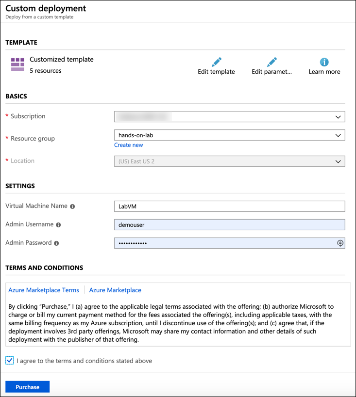

3. Select **Purchase**.

> It can take about 20 minutes to deploy the Lab VM. You can move on to the next task while the VM is deploying.

### Task 3: Provision a Jenkins server

In this task, you provision an Azure Linux VM, which will serve as your Jenkins server for this hands-on lab.

1. In the [Azure portal](https://portal.azure.com/), select the **Show portal menu** icon and then select **+Create a resource** from the menu.

    

2. Enter "jenkins" into the **Search the Marketplace** box, select the **Jenkins** compute item from the results, and then select **Create**.

    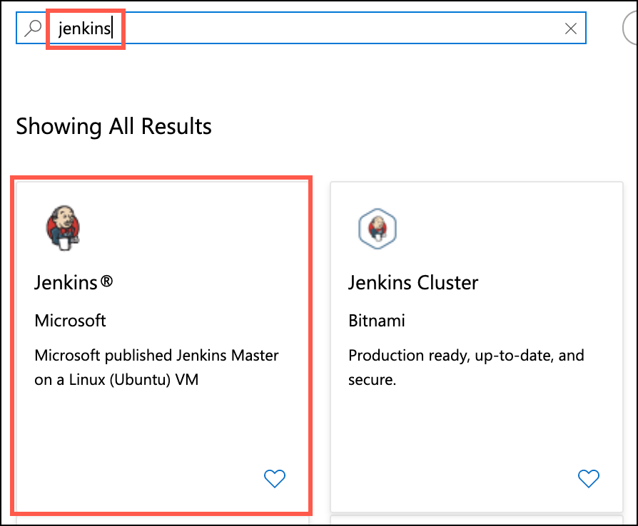

3. On the **Create Jenkins Basics** tab, enter the following:

    - **Subscription:** Select the subscription you are using for this hands-on lab.
    - **Resource group:** Select the hands-on-lab-SUFFIX resource group from the list.
    - **Region:** Select the region you are using for resources in this hands-on lab.
    - **Name:** Enter **Jenkins**.
    - **User name:** Enter **jenkinsadmin**.
    - **Authentication type:** Select **Password**
    - **Password:** Enter **Password.1!!**

    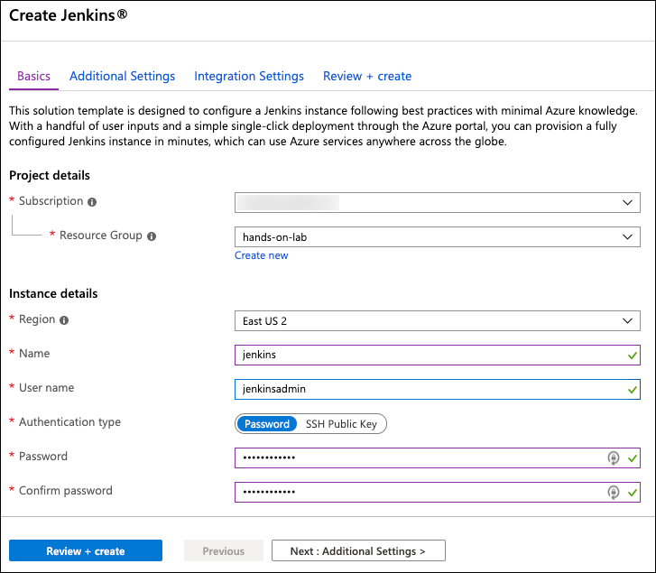

4. Select **Next: Additional settings**, and on the **Additional Settings** tab set the following configuration:

    - **Size**: Accept the default VM size of **Standard DS2 v2**.
    - **VM disk type**: Select **SSD**.
    - **Virtual network**: Accept the default value of **(new) jenkins-vnet**.
    - **Subnet**: Accept the default value of **(new) jenkins (10.x.0.0/24)**.
    - **Public IP address**: Accept the default value of **(new) jenkins-pip**.
    - **Domain name label**: Enter a globally unique value, such as **jenkins-SUFFIX**.
    - **Jenkins release type**: Select **LTS**.
    - **JDK Type**: Select **Zulu**.

    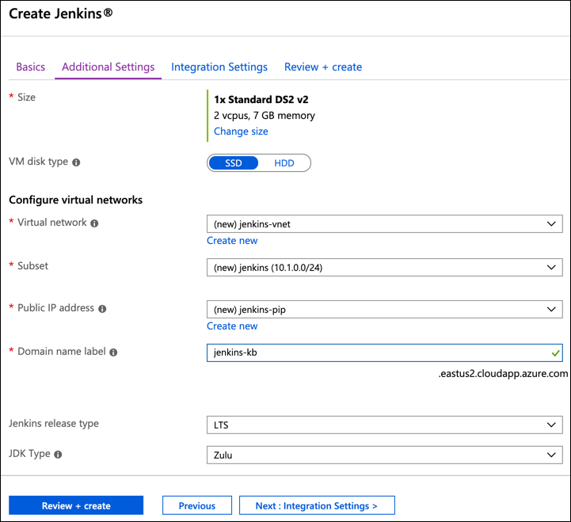

5. Select **Next: Integration settings**.

6. On the **Integration Settings** blade accept the default settings and select **Review + create**.

    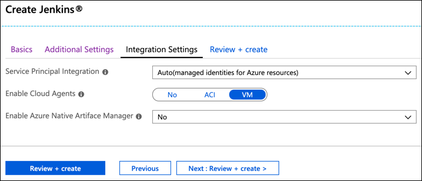

7. On the **Review + create** blade, ensure the `Validation passed` message is displayed, and then select **Create**.

    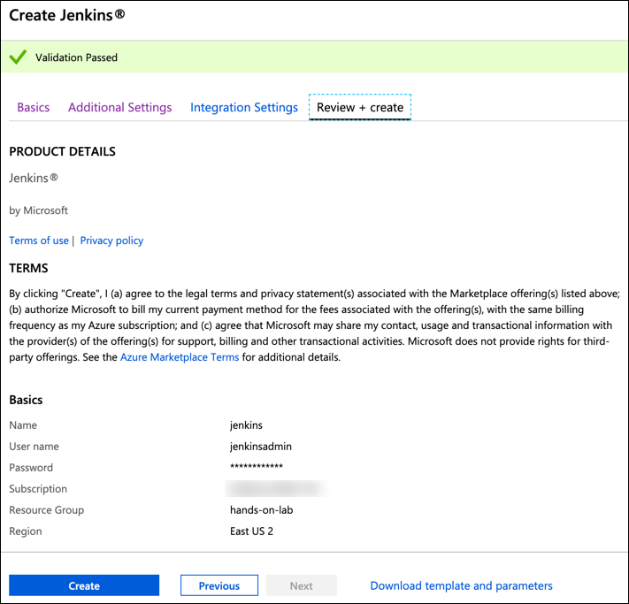

8. It can take 10+ minutes for the VM to provision. You can move on to the next task while you wait.

### Task 4: Provision Cosmos DB using the MongoDB API

In this task, you provision a new Azure Cosmos DB account using the MongoDB API.

1. In the [Azure portal](https://portal.azure.com/), select the **Show portal menu** icon and then select **+Create a resource** from the menu.

    

2. Enter "cosmos" into the Search the Marketplace box, select **Azure Cosmos DB** in the search results, and then select **Create**.

    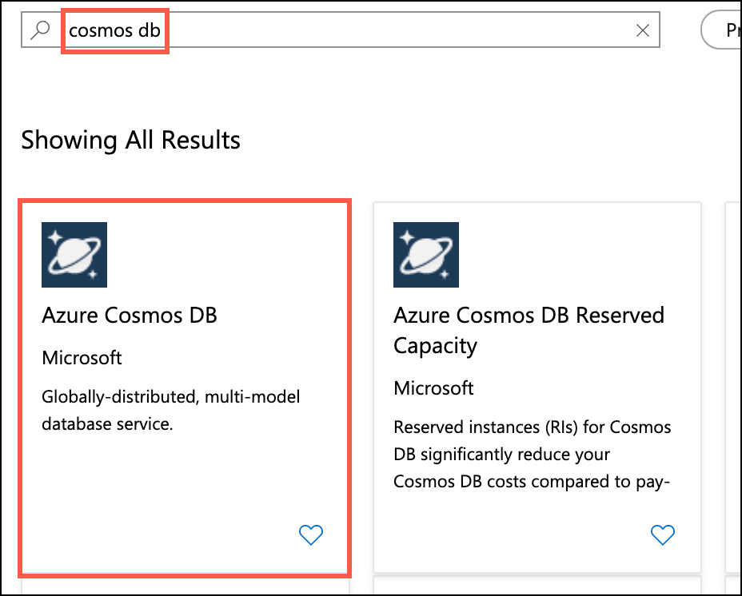

3. On the **Azure Cosmos** **DB** blade, enter the following:

    **PROJECT DETAILS**:

    - **Subscription:** Select the subscription you are using for this hands-on lab.
    - **Resource Group:** Select the **hands-on-lab-SUFFIX** resource group you created previously.

    **INSTANCE DETAILS**:

    - **Account Name**: Enter `best-for-you-db-SUFFIX`, where SUFFIX is your Microsoft alias, initials, or another value to ensure the name is unique (indicated by a green check mark).
    - **API:** Select **Azure Cosmos DB for MongoDB API**.
    - **Location:** Select a location near you from the list (Note: not all locations are available for Cosmos DB).
    - **Version**: Accept the default version.
    - **Enable geo-redundancy:** Select Disable.
    - **Multi-region Writes**: Select Disable.

    

4. Select **Review + create** to move to the validation step.

5. Ensure the **Validation Success** message is displayed, and then select **Create** to provision the new Azure Cosmos DB.

### Task 5: Create an Azure Container Registry

In this task, you create a private Docker registry in the Azure portal, so you have a place to store the custom Docker image you will create during the hands-on lab.

1. In the [Azure portal](https://portal.azure.com/), select the **Show portal menu** icon and then select **+Create a resource** from the menu.

    

2. Enter "container registry" into the Search the Marketplace box, select **Container Registry** from the results, and then select **Create**.

    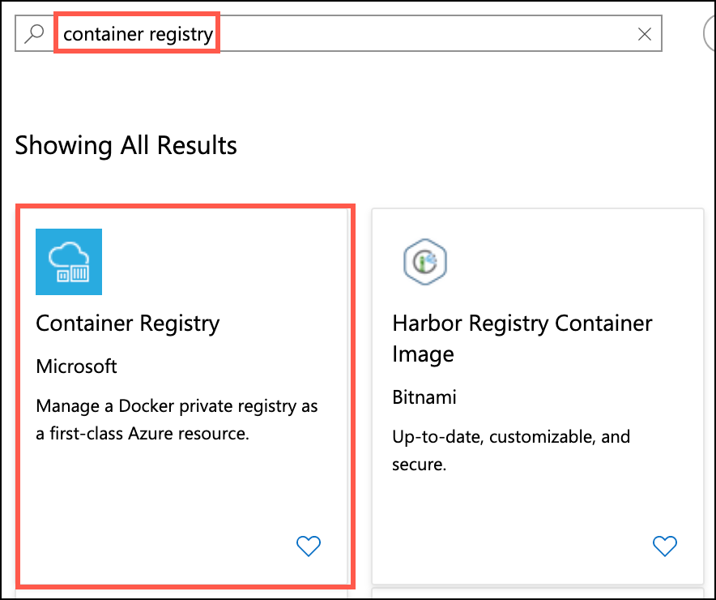

3. On the **Create container registry** blade, enter the following:

    - **Registry name:** Enter "bestforyouregistrySUFFIX," where SUFFIX is your Microsoft alias, initials, or another value to ensure the name is unique (indicated by a green check mark).
    - **Subscription:** Select the subscription you are using for this hands-on lab.
    - **Resource group:** Select the **hands-on-lab-SUFFIX** resource group created previously.
    - **Location:** Select the location you are using for resources in this hands-on lab.
    - **Admin user:** Select **Enable**.
    - **SKU:** Select **Basic**.

    

4. Select **Create** to provision the new Azure Container Registry.

### Task 6: Provision a Function App

In this task, you create a Function App in Azure to host your Functions.

1. In the [Azure portal](https://portal.azure.com/), select the **Show portal menu** icon and then select **+Create a resource** from the menu.

    

2. Enter "function app" in to the **Search the marketplace** box, and select **Function App** from the results.

    

3. On the **Function App** blade, select **Create**.

4. On the **Create Function App** blade, enter the following:

    - **Subscription:** Select the subscription you are using for this hands-on lab.
    - **Resource group:** Choose **Create new** and enter **hands-on-lab-func-SUFFIX** as resource group name.
    - **Function App name:** Enter a unique name, such as "bestforyouordersSUFFIX".
    - **Publish:** Select Code.
    - **Runtime Stack** Select Node.js.
    - **Region:** Select the region you have been using for resources in this hands-on lab.

    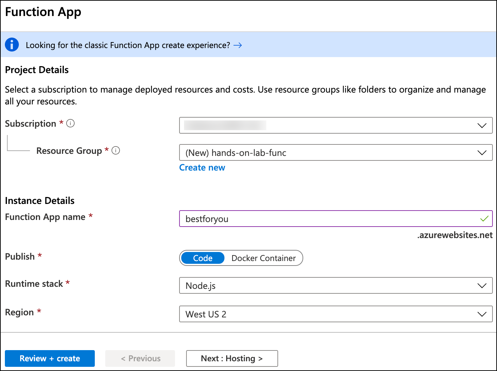

    > **Important**: Make sure you created a new resource group, as outlined above. Failure to do so will result in an error when you attempt to create the Function App.

5. Select **Next: Hosting**.

6. On the Hosting tab, set the following configuration:

    - **Storage account:** Select **Create new** and enter a globally unique name, such as "bestforyouordersSUFFIX."
    - **Operating System**: Select Windows.
    - **Plan type:** Choose Consumption.

    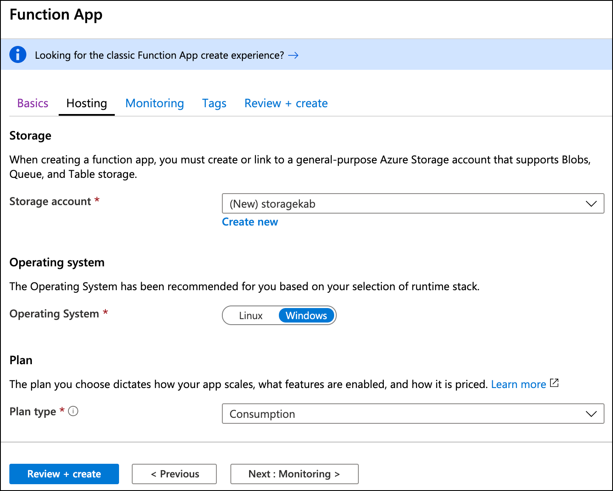

7. Select **Review + create**.

8. Select **Create** to provision the new Function App.

### Task 7: Create Logic App

In this task, you create a new Logic App, which will use a SendGrid connector to send email notifications to users, informing them that their order has processed and shipped.

1. In the [Azure portal](https://portal.azure.com/), select the **Show portal menu** icon and then select **+Create a resource** from the menu.

    

2. Enter "logic app" into the Search the Marketplace box, select **Logic App** from the results, and then select **Create**.

    

3. In the **Create logic app** blade, enter the following:

    - **Name:** Enter "OrderNotifications".
    - **Subscription:** Select the subscription you are using for this hands-on lab.
    - **Resource group:** Select **Use existing** and choose the **hands-on-lab-SUFFIX** resource group.
    - **Location:** Select the location you have been using for resources in this hands-on lab.
    - Select **Create** to provision the new Logic App.

    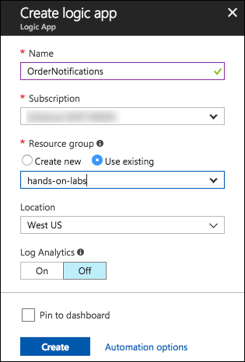

### Task 8: Create a GitHub account

In this task, you sign up for a free GitHub account, which is used for hosting a copy of the sample application used throughout this lab. This account will be integrated into the CI/CD workflow for pushing updates to the application into Azure.

> **Note**: If you already have a GitHub account, and wish to use that account, you can skip to the [next task](#task-5-fork-the-starter-app).

1. Navigate to <https://github.com> in a web browser.

2. In the form on the page, enter a **username**, your **email** address, and a **password**, then select **Sign up for GitHub**.

    

3. On the Welcome to GitHub screen, select **Unlimited public repositories free** under **Choose your personal plan** and select **Continue**.

    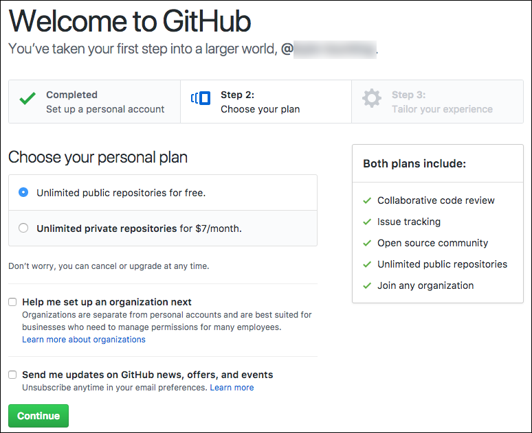

4. On the next screen, you can select options to tailor your experience and select **Submit**, or select **skip this step**, next to **Submit,** to complete your registration.

    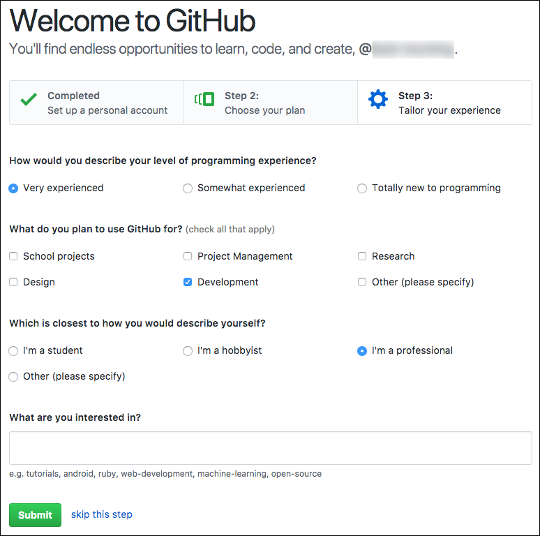

### Task 9: Fork the starter app

In this task, you will fork the [OSS PaaS and DevOps MCW GitHub repository](https://github.com/Microsoft/MCW-OSS-PaaS-and-DevOps) to create a copy of the starter application in your GitHub account.

> As part of this workshop, you will be linking a Jenkins Continuous Integration/Continuous Delivery pipeline to your GitHub repo and committing code changes into that forked repo. To do this, you must create a copy of the starter application in a repo where you have permission to commit changes.

1. Log into your GitHub account, and then navigate to the [OSS PaaS and DevOps MCW GitHub repository](https://github.com/Microsoft/MCW-OSS-PaaS-and-DevOps).

2. At the top right of the project's GitHub page, select **Fork**.

    

3. If you have more than one GitHub account, select the account you are using for this hands-on lab.

4. This will start the process of making a copy of the repo and starter application into your GitHub account, in a repository named **MCW-OSS-PaaS-and-DevOps**.

5. Once completed, the project page will open.

    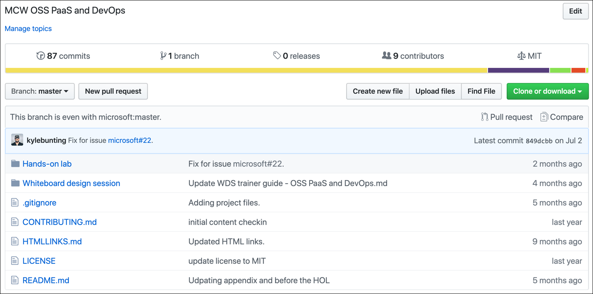

You should follow all steps provided *before* attending the Hands-on lab.
